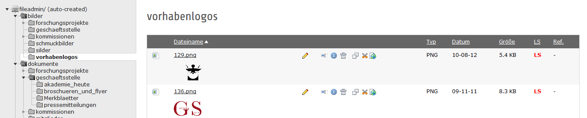

.. ==================================================
.. FOR YOUR INFORMATION
.. --------------------------------------------------
.. -*- coding: utf-8 -*- with BOM.

.. include:: ../../Includes.txt

.. _admin_template:

Template für Seiten einrichten
==============================
Um die folgenden Einstellungen vorzunehmen, benötigt man einen Admin-Account. Sie beziehen sich größtenteils auf Konfigurationen im Template einer Seite.

Knoten-Punkt anlegen
--------------------
Für Vorhaben, die ein eigenes Menü haben sollen, wird ein sogenannter Knoten-Punkt angelegt. Dazu wird ein Template für die Seite angelegt und im Reiter „Allgemein“ im Feld „Konstanten“ die Zeile

::

    ids.menuStart = Vorhaben-ID

eingefügt. Die Zahl ist dabei die ID der Vorhaben-Hauptseite.

Vorhabenlogo
------------
Für die Seiten der Vorhaben besteht die Möglichkeit ein eigenes Logo darzustellen.

Das Logo muss in den Abmaßen von max. 220x150 Pixel vorliegen und ein PNG sein. Laden Sie das Bild in den Ordner vorhabenlogos (siehe dazu 3.4.1 Bilddateien hochladen). Bitte benennen Sie das Bild mit der ID des Vorhabens.

Im Template der Seite ändern Sie die Zeile:

::

    set_logo = Vorhaben-ID

Im Beispiel von Germania Sacra:

::

    set_logo = 136

Seitennavigationstitel für ein Vorhaben anlegen
-----------------------------------------------
Der Seitennavigationstitel für ein Vorhaben ist der rote Link unter „Akademie der Wissenschaften zu Göttingen“ im Header. Dazu sind die folgenden Einstellungen bei den Konstanten notwendig.
Geben Sie die ID der Vorhaben-Seite ein und geben Sie den deutschen und englischen Text ein, der angezeigt werden soll:

::

    set_pagenavititle = Vorhaben-ID
    pagenavititle {
    de = Deutscher Text
    en = Englischer Text
    }

Exemplarisch sehen Sie hier die Einstellungen im Template der Seite „Deutsche Inschriften“:

Auswahl Teaser oder Vorhabenlogo
--------------------------------
Wenn Sie keinen Teaser bzw. kein Logo anzeigen lassen möchten, ergänzen Sie die Zeile:

::

    set_blank = 1

DINI-Logo konfigurieren
-----------------------
Das DINI-Zertifikat 2010-Logo kann auf einzelnen Seiten angezeigt werden. Dazu passen Sie das Seiten-Template an:

::

    show_logo_dini = 1

Wenn dieser Wert nicht gesetzt ist, wird das Logo nicht angezeigt.

