.. ==================================================
.. FOR YOUR INFORMATION
.. --------------------------------------------------
.. -*- coding: utf-8 -*- with BOM.

.. include:: ../../Includes.txt

.. _grundlagen_benutzeroberflaeche:

1.3 Benutzeroberfläche
======================
Einige Benutzer (z. B. die Redakteure der Geschäftsstelle) sehen den gesamten Seitenbaum und können dort auch Veränderungen vornehmen. Die Redakteure der Forschungsvorhaben sehen zwar den Seitenbaum, können jedoch nur bei ihren Vorhaben Veränderungen vornehmen. Sie können nur in diesem Bereich und in zentralen Ordnern, auf die alle Redakteure Zugriff haben, etwas verändern.

1.3.1 Aufbau
------------
Die Arbeitsoberfläche von TYPO3 ist in **drei Hauptbereiche** unterteilt.

1. **Links** sehen Sie die **Modulleiste**. Hier wählen Sie aus, welche Art von Arbeiten Sie durchführen wollen.
2. **In der Mitte** sehen Sie die Navigationsleiste mit dem **Seiten- oder Dateienbaum**. Hier wählen Sie aus, welche Webseite oder welchen Dateien-Ordner Sie bearbeiten wollen.
3. **Rechts** sehen Sie die Detailansicht mit der **Arbeitsfläche**. Hier führen Sie Ihre Arbeiten durch.

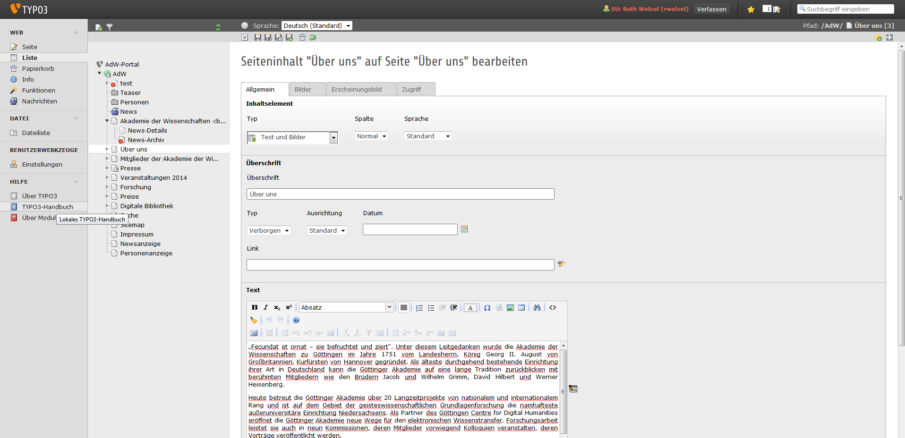

Die Anordnung der drei Bereiche entspricht auch der Reihenfolge bei der Arbeit:

1. Zuerst in der **Modulleiste** das Modul auswählen (z.B. Web / Liste),
2. dann im **Seitenbaum** die Webseite auswählen (z.B. Über uns) und
3. dann in der **Arbeitsfläche** die eigentliche Arbeit an dieser Webseite durchführen.

1.3.2 Modulleiste
-----------------
Durch Klicken auf die Modulbezeichnungen gelangen Sie in den entsprechenden Arbeitsbereich.

Die wichtigsten Module sind:

* Web / Liste (Web / List)
* Datei / Dateiliste (File / Filelist)

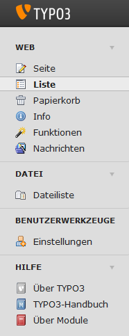

1.3.3 Seitenbaum
----------------
Der **Seitenbaum** steht Ihnen für alle Module der **Modulgruppe Web** zur Verfügung. Er stellt die Struktur Ihrer Webseite baumartig dar.

In der **Modulgruppe Datei** wird stattdessen der **Dateienbaum** angezeigt. Er stellt die Struktur der Ordner für den Upload von Dateien baumartig dar.

In beiden Fällen können Sie Teilbäume durch Klicken auf die Pfeile auf- und zuklappen:

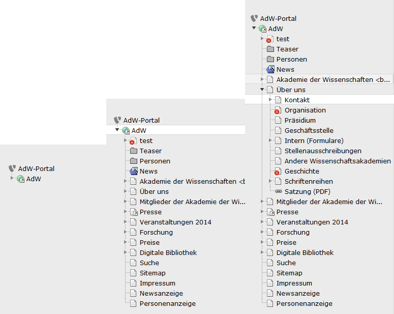

Jeder Benutzer sieht den kompletten Seitenbaum, die Berechtigungen können aber so eingestellt werden, dass nur für bestimmte Seiten die Zugriffsberechtigung zum Bearbeiten erteilt werden. Die Administratoren haben Zugriff auf den gesamten Seitenbaum.

Im Seiten- und Dateienbaum sind **Kontextmenüs** mit vielen nützlichen Befehlen verfügbar. Diese Kontextmenüs werden durch einen Klick mit der **rechten oder linken Maustaste** auf das jeweilige **Symbol** vor dem Text oder mit der **rechten Maustaste** auf den **Text** aufgerufen.

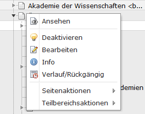

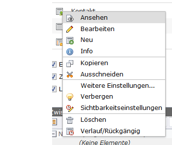

1.3.4 Arbeitsfläche
-------------------
Der große rechte Teil ist die **detaillierte Arbeitsoberfläche**. Hier werden die einzelnen Bestandteile des von Ihnen ausgewählten Elementes angezeigt. Die Bearbeitungsoptionen (und damit auch die Art der Darstellung in der Arbeitsfläche) sind **abhängig** von dem jeweiligen **Modul**, mit dem Sie gerade arbeiten. Details dazu finden Sie **in den folgenden Kapiteln**. Hier zeigen wir Ihnen als **ein Beispiel** die Arbeitsfläche für das Editieren eines Inhaltselementes:

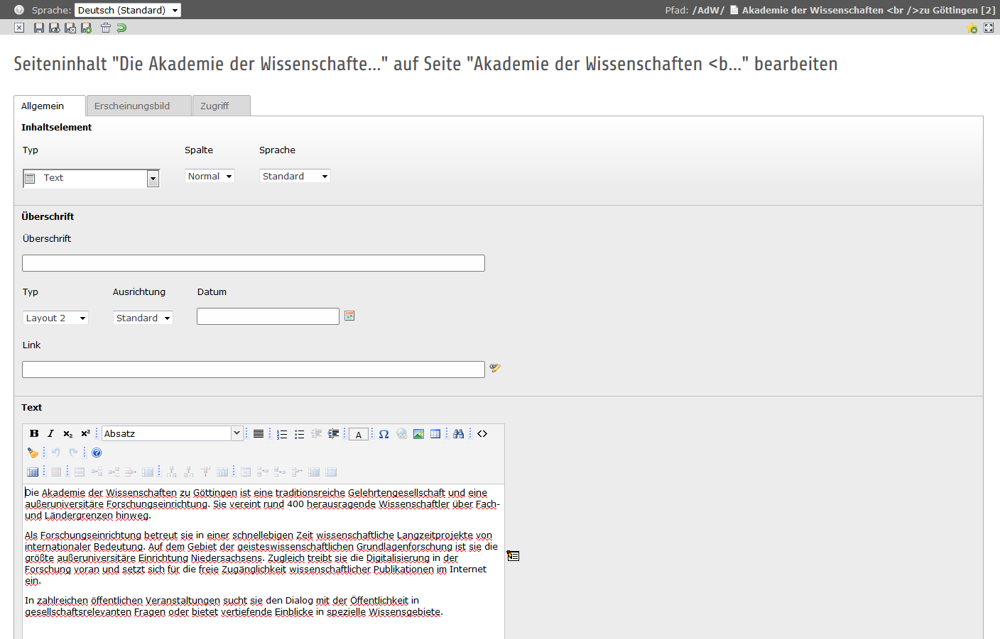

Im Kopf der Arbeitsfläche finden Sie in der Regel den **Pfad** für das geöffnete Element und **Icons zur weiteren Bearbeitung**.

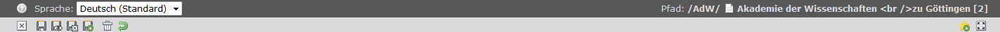

Alle Icons (Bildschaltflächen) zur Bearbeitung Ihrer Seiten und Inhalte sind mit einer **sensitiven Hilfe** versehen. Das heißt, wenn Sie mit dem Mauszeiger über die Icons fahren, wird Ihnen deren Funktion angezeigt.

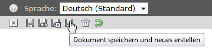

**Tipp:** Falls Ihnen der für die Arbeitsfläche innerhalb des Web-Browsers zur Verfügung stehende Platz nicht ausreicht, können Sie diesen Platz vergrößern: Mit einem Klick auf den Pfeil im schmalen Streifen zwischen Seitenbaum und Arbeitsfläche können Sie den Seitenbaum aus- und wieder einblenden und damit bei Bedarf mehr Platz für die Arbeitsfläche erzeugen.

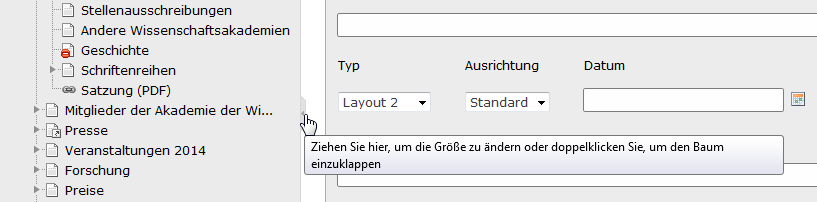

1.3.5 Benutzerwerkzeuge - Einstellungen
---------------------------------------
Ihren Namen und Ihr Passwort haben Sie erhalten, bitte gehen Sie sorgfältig damit um. Verändern Sie von Zeit zu Zeit Ihr Passwort. Sichere Passwörter sollten eine Länge von acht oder mehr Zeichen haben. Ein Passwort sollte aus einer Mischung von Groß- und Kleinbuchstaben, Ziffern und Sonderzeichen bestehen. Vorinstallierte Passwörter sollten bei Übernahme des Systems umgehend geändert werden.

Sie können alle Felder und Reiter wie voreingestellt belassen. Wenn Sie jedoch Änderungen vornehmen möchten, empfehlen wir Ihnen Folgendes:

Sie können Ihre **Spracheinstellung** im Backend unter Benutzerwerkzeuge und dort unter Einstellungen ändern. Im ersten Reiter "Persönliche Daten" können Sie als Sprache Deutsch oder Englisch auswählen.

Im zweiten Reiter „Beim Start“ können Sie unter **„Beim Start folgendes Modul aufrufen“** dasjenige Modul wählen, dass Ihnen nach dem Einloggen in das TYPO3-Backend als erstes angezeigt werden soll.

Im dritten Reiter „Bearbeiten und erweiterte Funktionen“ sollten Sie die Haken entfernen:

„Hochladen von Dateien direkt im Web-Modul“.

**Tipp:** Unter Umständen hat der Administrator bei Ihnen diese Einstellungen bereits vorgenommen.

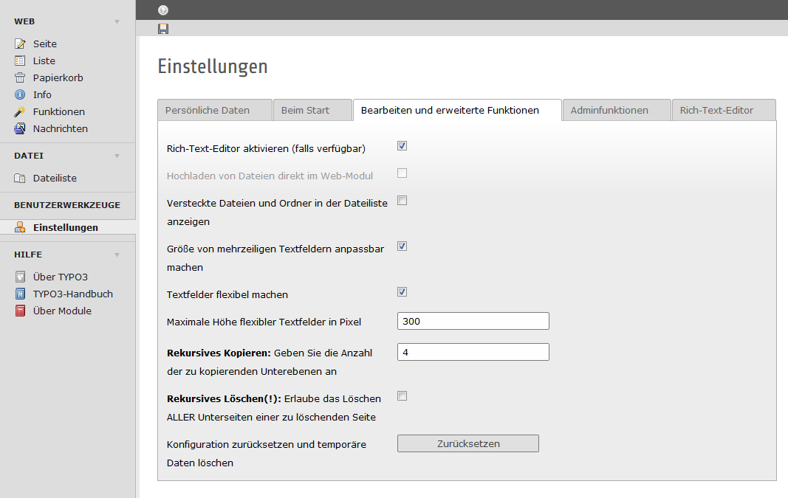

1.3.6 Logout
------------
Ganz rechts oben, immer sichtbar ohne zu scrollen, sehen Sie den Knopf **Abmelden** (Logout) und die Anzeige, unter welchem Benutzernamen Sie eingeloggt sind.

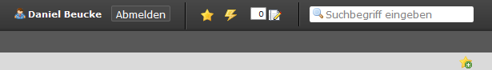

Zum **Beenden** einer Arbeitssitzung melden Sie sich aus Sicherheitsgründen bitte immer ab.

