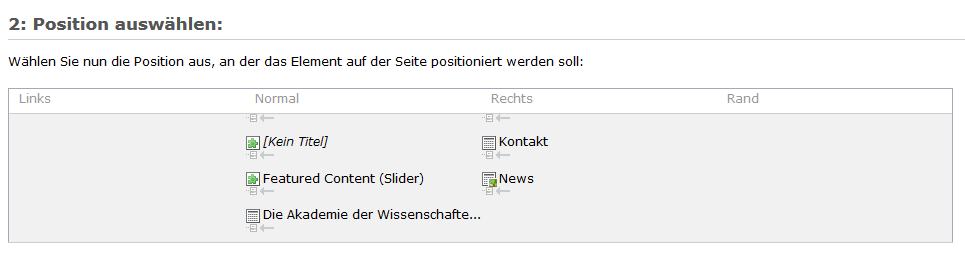
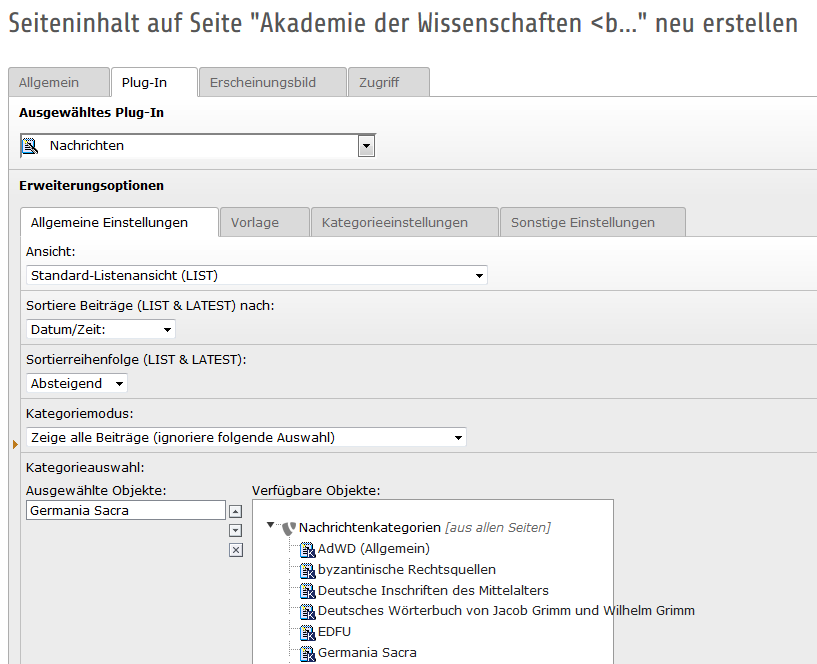

.. ==================================================
.. FOR YOUR INFORMATION
.. --------------------------------------------------
.. -*- coding: utf-8 -*- with BOM.

.. include:: ../../Includes.txt

.. _news_anzeigen:

5.2 News anzeigen
=================
So gehen Sie vor, wenn Sie für  Seiten (z.B. Forschungsvorhaben) News anzeigen lassen möchten:

**Schritt 1:**

Gehen Sie im **Seitenbaum** auf den Titel der Seite, auf dem die Nachrichten erscheinen sollen.

Klicken Sie auf das Icon mit dem grünen Pluszeichen **Neuen Datensatz erstellen** (Create new record). Legen Sie ein neues **Seiteninhaltselement** an, indem Sie die unter Seiteninhalt den Assistenten aufrufen.

**Schritt 2:**

Wählen Sie den **Typ** des Inhaltselements aus, in unserem Fall unter **Plug-Ins** "Nachrichten".

:width: 1000px

Klicken Sie dann unter „2. Position auswählen“ auf den Pfeil unter „Normal“ und setzen Sie das neue Inhaltselement an die gewünschte Stelle.

:width: 1000px

**Schritt 3:**

Tragen Sie im Reiter Allgemein die Überschrift ein.

**Schritt 4:**

Wählen Sie im Reiter Plug-In im Unterreiter Allgemeine Einstellungen die Ansicht, die Kriterien für die Sortierung der Beiträge, die Reihenfolge der Sortierung aus, z. B. wie hier:

:width: 1000px

Wenn Sie auf der Seite Vorhaben1 alle Nachrichten dieser Kategorie anzeigen lassen möchten, wählen Sie die Kategorie unter „Verfügbare Objekte“ aus und stellen im Kategoriemodus und „UND“-Modus ein.

**Schritt 5:**

Im Reiter **Sonstige Einstellungen** wählen Sie unter „Seite für die Einzelansicht“ die Seite aus, auf der einzelnen aktuellen Nachrichten angezeigt werden. Klicken Sie auf „Datensätze durchblättern“ und wählen Sie die entsprechende News-Details-Seite aus.

Ebenso bestimmen Sie unter „Seite für ‚Zurück’“ die Seite aus, zu der der Nutzer wieder zurückkehren sollen, wenn er die Detailansicht verlassen möchte.

Weitere Einstellungen brauchen Sie nicht vorzunehmen.
Speichern und schließen Sie die Seite.

**Tipp:** Vieles kann zentral vom Administrator vorgegeben werden, ohne dass es von den Redakteuren bei jeder News-Seite neu definiert werden muss.

