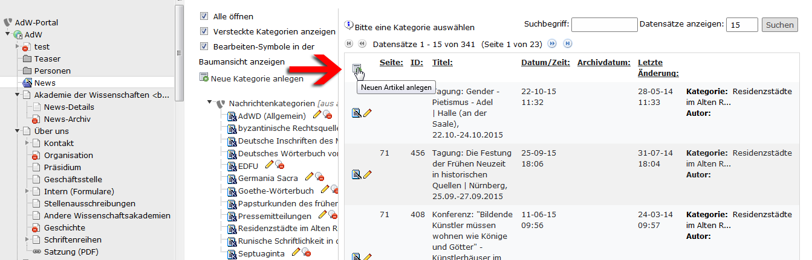

.. ==================================================
.. FOR YOUR INFORMATION
.. --------------------------------------------------
.. -*- coding: utf-8 -*- with BOM.

.. include:: ../../Includes.txt

.. _news_erstellen:

5.1 News-Inhalt erstellen
=========================
Die News werden im Systemordner News zentral erstellt.
Gehen Sie dafür im Web-Modul auf den Ordner **Nachrichten**:

Alle Texte der Nachrichten liegen zentral im Ordner News (ID=71)
Unter Nachrichten (News) können Sie die Meldungen anlegen und bearbeiten.

Unter Nachrichtenkategorien (News Category) sollten Sie Rubriken anlegen, denen Sie die Meldungen zuordnen können. Damit können Sie z. B. gezielt nur Nachrichten aus einem bestimmten Vorhaben anzeigen lassen oder Meldungen aus verschiedenen Bereichen kombiniert anzeigen lassen.

**Schritt 1:**

Klicken Sie auf das Icon mit dem grünen Pluszeichen **Neuen Artikel anlegen**.

Standardmäßig ist eine neue Nachricht verborgen, damit Sie die Inhalte vervollständigen können, bevor Sie sie anzeigen möchten.

Der Typ **Nachrichten** ist der gebräuchlichste News-Typ. Setzen Sie ihn ein, wenn Sie eine Meldung mit „Anreisser“ (Teaser) und automatisch erzeugtem Link auf die vollständige Nachricht erzeugen möchten. Geben Sie im Feld Titel die Überschrift der Nachricht ein.

Im Feld Text geben Sie den eigentlichen Inhalt Ihrer Nachricht ein. Wie gewohnt können Sie alle Funktionalitäten des RTE nutzen.

**Schritt 2:**

Im Reiter **Spezial** (Special) geben Sie das **Veröffentlichungsdatum** an. Voreingestellt ist der Zeitpunkt, an dem der neue Datensatz angelegt worden ist. Im Feld **Archivdatum** können Sie bestimmen, wann eine Nachricht automatisch in das News-Archiv verschoben werden soll.

Standardmäßig ist Deutsch als Sprache eingestellt.

**Schritt 3:**

Im Reiter **Kategorien & Beziehungen** (Categories & Relations) wählen Sie unter „Verfügbare Objekte“ die Nachrichtenkategorie aus, in die Ihre neue Nachricht gehört. Das Symbol "Ausrufungszeichen" zeigt an, dass es sich um eine verpflichtende Eingabe handelt.

**Tipp:** Durch Klicken auf das Dreieck vor den Nachrichtenkategorien werden alle vorhandenen Kategorien sicht- und auswählbar.

**Schritt 4:**

Speichern und schließen Sie den neuen Datensatz.

