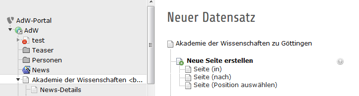
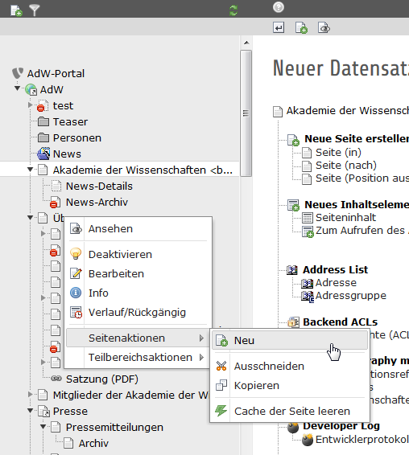
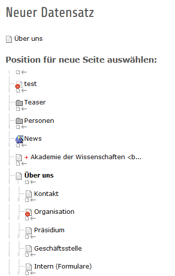
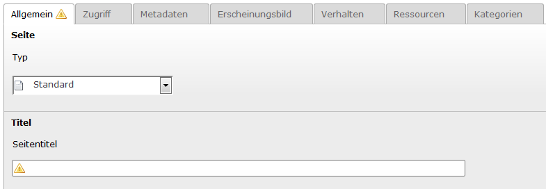
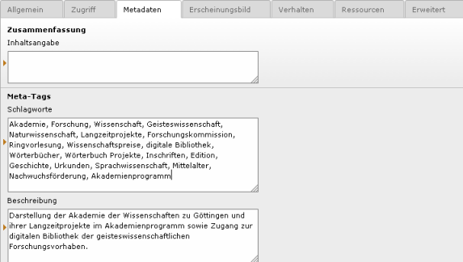
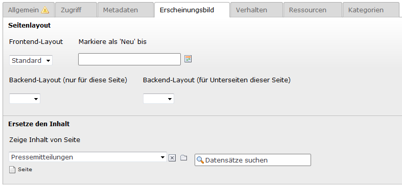
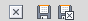
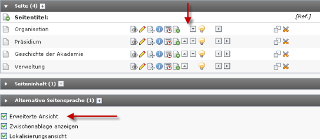

.. ==================================================
.. FOR YOUR INFORMATION
.. --------------------------------------------------
.. -*- coding: utf-8 -*- with BOM.

.. include:: ../../Includes.txt

.. _seiten_neueseite:

2.1 Eine neue Seite anlegen
===========================
Die Grundstruktur der AdW-Webseite ist bereits in TYPO3 angelegt. Es könnte jedoch vorkommen, dass Sie für Ihre Bereiche neue Seiten anlegen müssen. Sie fügen also an einer beliebigen Stelle Ihres Seitenbaums eine neue Seite ein.

Dazu verwenden Sie am besten in der Modulleiste das Modul **Web/Liste** (Web/List). Anhand der Listenansicht werden in dieser Einführung die Arbeitsschritte erklärt.

**Übrigens:** Sie können auch das Modul Web/Seite (Web/Page) nutzen, Sie können dort in mehreren Spalten arbeiten.

**Die wichtigsten Icons für Seiten:**

Neuen Datensatz erstellen

speichern und weiter arbeiten

speichern und anzeigen

**Schritt 1:**

Suchen Sie im **Seitenbaum** die Seite, unter der oder neben der Sie eine neue Seite anlegen wollen. Klicken Sie auf den Namen dieser Seite.

**Schritt 2:**

Klicken Sie über der Arbeitsfläche auf das Icon **Neuen Datensatz erstellen** (Create New Record) und wählen Sie **Neue Seite erstellen** und wählen Sie die Position für Ihre neue Seite:

**Alternativ** können Sie auch im Seitenbaum das Kontextmenü öffnen, darin den Punkt Seitenaktionen (Page actions) auswählen, dann den Punkt **Neu** (New) wählen:

Sie wählen dann die Position der Seite aus, indem Sie mit der Maus über die Pfeile fahren. Wenn an der von Ihnen gewünschten Position der Pfeil erscheint, klicken Sie einfach darauf:

**Schritt 3:**

Nun erscheint die Arbeitsfläche für die Einstellungen der Seite.
Geben Sie im Eingabefeld **Seitentitel** (Page Title) die Bezeichnung an, unter der die Seite in der Navigationsleiste erscheinen soll (Pflichtfeld).

Wenn die Seite neu angelegt wird, wird sie standardmäßig verborgen, d.h. sie ist noch nicht öffentlich sichtbar. Im Reiter **Zugriff** (Access) unter Sichtbarkeit (Visibility) können Sie die Seite sichtbar machen, indem Sie den Haken bei deaktivieren (Page Disable) entfernen.

Im Reiter **Metadaten** (Metadata) geben Sie eine kurze Beschreibung der Seite ein. Suchmaschinen zeigen diese in ihren Trefferlisten an. Daher sollte die Beschreibung kurz sein (maximal 160 Zeichen) und bei der Anzeige in der Trefferliste Sinn ergeben. Weisen Sie der Seite Schlagwörter zu:

**Tipp:** Da die Schlagwörter und Beschreibungstexte für alle AdW-Seiten identisch sein sollen, sind die Inhalte zentral hinterlegt worden und diese Felder erscheinen leer. Wenn Sie abweichende Inhalte eingeben möchten, können Sie das bei den betreffenden Seiteneigenschaften vornehmen.
Wenn Sie die Inhalte einer bereits existierenden Seite auf Ihrer neuen Seite anzeigen lassen möchten, können Sie diese Einstellung im Reiter **Erscheinungsbild** (Appearance) unter „Ersetze den Inhalt“ vornehmen:

Dies ist sinnvoll, wenn eine Seite an mehreren Stellen im Seitenbaum (d.h. im Menü der Webseite) erscheinen soll. Die Inhalte dieser Seite müssen dann nur an einer Stelle gepflegt werden.

Klicken Sie auf das Ordner-Symbol (Datensätze durchblättern) und wählen Sie die entsprechende Seite aus. Durch Klick auf das X können Sie die Seite wieder entfernen.

**Tipp:** Es gibt auch den Seitentyp **Shortcut** (Verweis). Bei der AdW-Webseite verweist beispielsweise die Seite „Presse“ ID=4 (ohne Inhalt) auf die Seite „Pressemitteilungen“ ID=15.

Im Reiter **Erweitert** (Extended) ist standardmäßig ausgewählt, dass im Frontend das Datum der letzten Änderung der Seite angezeigt wird. Falls Sie das nicht wünschen (z.B. wenn sich der Inhalte nur selten ändert), entfernen Sie bitte den Haken.

**Schritt 4:**

Gehen Sie auf **Dokument speichern und schließen** (Save and close document).

Die Buttons für das Speichern und Schließen befinden sich in der grauen Leiste ganz oben und sind immer sichtbar.

Ihre neue Seite ist angelegt und erscheint im Seitenbaum. Allerdings ist die Seite noch leer, sie hat noch keinen Inhalt (siehe Abschnitt 2.2).

**Tipp:** Vergessen Sie nicht das Speichern! Wenn Sie die Arbeitsfläche schließen oder (z. B. durch Auswahl einer anderen Seite) verlassen, ohne zu speichern, gehen alle Ihre Eingaben seit der letzten Speicherung verloren.

Wenn Sie die Reihenfolge der Seiten nachträglich ändern wollen, können Sie das auf verschiedene Arten erreichen, unter anderem im Modul **Web/Liste** (Web/List) in der Arbeitsfläche mit eingeschalteter "Erweiterter Ansicht" (extended view) mit Hilfe der verschiedenen Pfeil-Symbole bei den jeweiligen Seiten. Die erweiterte Ansicht erhalten Sie, wenn Sie im unteren Bereich der Arbeitsfläche bei "Erweiterte Ansicht" einen Haken setzen.

**Übrigens:** Das Verschieben von Seiten kann unbeabsichtigte Auswirkungen haben (z.B. auf die URL), bitte sprechen Sie Veränderungen daher auch mit Ihrem Administrator ab.