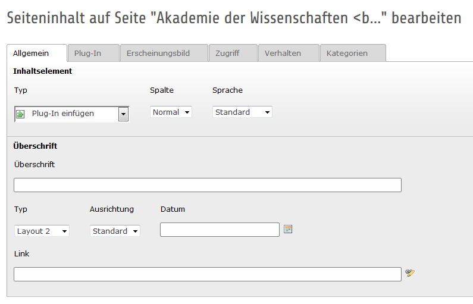
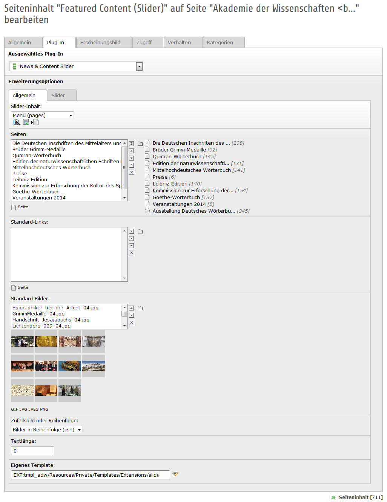

.. ==================================================
.. FOR YOUR INFORMATION
.. --------------------------------------------------
.. -*- coding: utf-8 -*- with BOM.

.. include:: ../../Includes.txt

.. _slider:

7 Slieder mit Bildern
=====================
Das Plug-In für den Slider ist umfangreicher und beinhaltet weitere Möglichkeiten, als bisher bei der AdW-Seite eingesetzt. Hier wird lediglich der verwendete Slider beschrieben. Für weitere Informationen bitte im Handbuch zum Slider allgemein nachschlagen (https://adw-goe.de/typo3conf/ext/t3s_jslidernews_/doc/manual.sxw).

Ist der Bilder-Slider für die mittlere Content-Spalte vorgesehen, dann ist eine max. Breite von 520px festgelegt. Die Höhe des Slider kann theoretisch variieren, für ein sinnvolles Seitenverhältnis schlagen wir allerdings in der Höhe 225px vor. In diesen Abmaßen sollten die Bilder vorbereitet werden und im Format GIF, JPG, JPEG oder PNG vorliegen.

Die Bilder müssen im Dateiverzeichnis (Filelist) in den Ordner bilder > silder (sic!) hochgeladen werden.

**Schritt 1:**
Neues Seiteninhaltselement vom Typ Plug-In erstellen.

**Schritt 2:**

Wählen Sie über den Reiter „Plug-In“ den „News & Content Slider“ aus.

**Schritt 3:**

Wählen Sie unter „Slider-Inhalt“ die Option „Menü (pages)“ aus. Bei diesem Slider werden wie auf der AdW-Startseite Bilder mit Links auf Seiten dargestellt.

**Schritt 4:**

Unter dem Punkt „Seiten“ werden die Links zu den Seiten erstellt. Beim Punkt „Standard-Bilder“ werden die jeweiligen Bilder ausgewählt. Wichtig dabei ist die Reihenfolge der beiden Listen. Die erste Seite ist mit dem ersten Bild verknüpft und so weiter.

Für detaillierte Einstellungen können Sie sich auf dem Development-Server weiter informieren.

