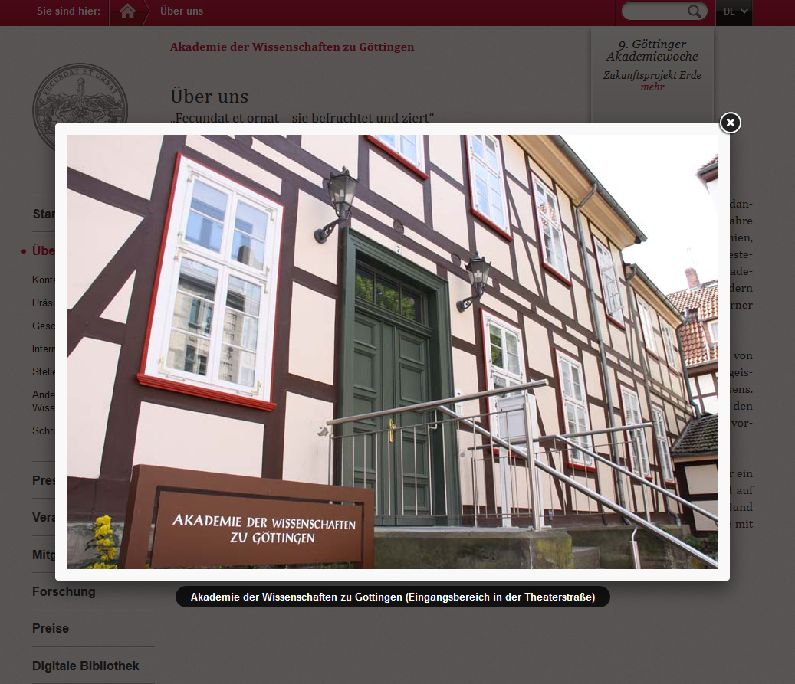

.. ==================================================
.. FOR YOUR INFORMATION
.. --------------------------------------------------
.. -*- coding: utf-8 -*- with BOM.

.. include:: ../Includes.txt

.. _bilder:

Bilder
======

Bildergalerie
-------------

Für das Darstellen von mehreren Bildern, die ohne Text auf einer Seite stehen, sollte eine Galerie verwendet werden. Die Benutzung der Extension wird im Redaktionshandbuch beschrieben.

Darstellung der Bilder
----------------------

Beim Klick auf die Bilder werden sie – sofern es nicht explizit abgeschaltet wird – vergrößert (in einer sog. Lightbox) angezeigt. Dabei skaliert das System die Bilder automatisch, so dass sie maximal bildfüllend dargestellt werden.

Dateiformate
------------

Bilddateien sollten in den Formaten PNG oder JPG verwendet werden.

Für Grafiken (z. B. Logo) sollte GIF verwendet werden.

Größe der Bilder
----------------

Rechte Spalte
~~~~~~~~~~~~~
Bilder in der rechten Spalte werden per default über die gesamte Breite dargestellt.

Content Spalte
~~~~~~~~~~~~~~
Die Bilder werden per default über die gesamte Breite (bei Inhaltselement Bild) oder über die Hälfte der Breite (bei Inhaltselement "Bild und Text") dargestellt. Wenn andere Einstellungen gewünscht sind, dann muss das im Backend vorgenommen werden. Es können relative Angaben gemacht werden (siehe Screenshot); "Hälfte", "Ein Drittel", "Zwei Fünftel".

Personenbilder
~~~~~~~~~~~~~~
Die Größe für Personenbilder sollte in der Breite einen einheitlichen Wert haben, um eine Bündigkeit zu gewährleisten.

Empfohlen wird die Breite "Zwei Fünftel".

Metadaten der Bilder
--------------------

Um die Barrierefreiheit der Website zu gewährleisten, müssen  die Bilder mit Metadaten beschrieben werden. Es gibt die Felder Titel, Beschriftung und alternativer Text.

Hinweise zur Nutzung der Metadaten: …

Bedeutung der Metadaten
~~~~~~~~~~~~~~~~~~~~~~~
**Titel:** Wird bei der großen Darstellung unter dem Bild angezeigt.

**Alternativer Titel:** Wird für den barrierefreien Zugang genutzt und z. B. vom Screenreader vorgelesen.

**Beschreibung:** Steht unter dem Bild und sollte kurz und prägnant sein.

.. figure:: ../../Images/StyleGuideline/BildBeschreibungFE.png
	:width: 400px
	:alt: Beschreibung

Bilder bei News
--------------
Die Bilder bei den News sollen über den Editor einfügt bzw. bearbeitet werden. Damit kann die Platzierung im Text vorgenommen werden und die Bilder werden beim Klick vergrößert dargestellt.

Positionierung von Bildern
--------------------------

In der rechten Spalte
~~~~~~~~~~~~~~~~~~~~~
Die Bildgröße wird per default auf die gesamte Breite der Spalte angepasst. Bildunterschriften werden immer linksbündig dargestellt.

In der Content-Spalte
~~~~~~~~~~~~~~~~~~~~~
In der mittleren Inhaltsspalte stehen verschiedene Möglichkeiten zur Positionierung von Bildern zur Verfügung.

- Bild als eigenes Inhaltselement einfügen. In der Grundeinstellung wird das Bild auf die gesamte Spaltenbreite skaliert.
- Bild mit Text: Das Bild ist oben links platziert und der Text fließt um das Bild. Die Bildgröße wird automatisch angepasst, kann aber auf "Hälfte", "Ein Drittel" bzw. "Zwei Fünftel" geändert werden.
- Zum Einbinden von mehrere Bildern sollte eine Galerie verwendet werden (s.o.). Alternativ können Bilder im Contentbereich zweispaltig eingebunden werden. Dabei werden die Bilder automatisch an die Spaltenbreite angepasst und in zwei Spalten angezeigt. Es sollte darauf geachtet werden, dass die Bilder das selbe Format (Hoch- oder Querformat) haben. 

Bei den ersten beiden Optionen können die Bildbreiten auch selbst angepasst werden, wovon aus ästhetischen Gründen abgeraten wird.

Qualität von Bildern
--------------------

Das Bild sollte in bester Qualität (d. H. größtmöglicher Auflösung) in das System eingestellt werden - TYPO3 ist für die Skalierung zuständig, dies muss nicht von Redakteuren vorgenommen werden.

Regeln zur Benennung von Bildern
--------------------------------

Bei der Benennung der Dateien sollten folgende Regeln beachtet werden:

- Vorhabenlogo: *vorhaben*_logo.png (Beispiel: germania_sacra_logo.png)
- Personenfoto: *nachname_vorname*.png (Beispiel: schade_angelika.png)
- Sliderbilder: *vorhaben*_slider_*nummerierung*.png (Beispiel: runes_slider_01.png)

**Vorschlag:**

- Bilder in Vorhaben: *bildname*.png (Beispiel: tempel01.png)
