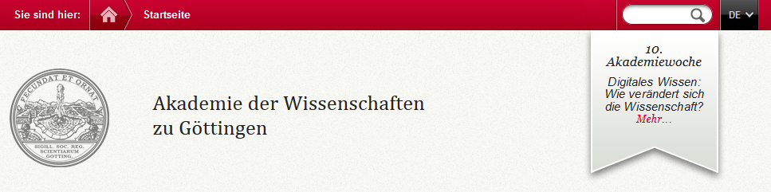

.. ==================================================
.. FOR YOUR INFORMATION
.. --------------------------------------------------
.. -*- coding: utf-8 -*- with BOM.

.. include:: ../../Includes.txt

.. _teaser:

6 Teaser bearbeiten
===================
Auf den Seiten der AdW befindet sich in der oberen rechten Ecke der Teaser mit einer aktuellen Meldung und der Möglichkeit mit einem Link auf weitere Informationen zu springen. Dieser Inhalt wird zurzeit ausschließlich von der AdW-Geschäftsstelle erstellt!

6.1 Teaser-Text erstellen
-------------------------
Der Text für den Teaser der AdW-Webseite befindet sich im Seitenbaum im Ordner Teaser (ID=401).

Im Frontend wird der Inhalt des Teasers angezeigt, der im Backend als erstes Seiteninhaltselement erscheint.

**Schritt 1:**

Sie befinden sich im Seitenbaum im Ordner „Teaser“ (ID=401). Legen Sie ein neues Seiteninhaltselement an, indem Sie auf das Symbol **Datensatz erstellen** klicken.

Es erscheint die Arbeitsfläche für das Editieren eines Inhaltselements. Geben Sie im Reiter **Allgemein** (General) die Überschrift (Header) ein. Die Einstellung Layout 2 unter Typ behalten Sie bei. Dann können Sie unter „Text“ mit der Eingabe Ihres Textes beginnen. In Kapitel 3 können Sie nachlesen, wie Sie den eingegebenen Text mit Hilfe des Rich-Text-Editors bearbeiten können.

**Schritt 2:**

Sind Sie mit der Bearbeitung des Seiteninhalts fertig, klicken Sie auf das Icon **Dokument speichern und schließen** (Save and close document).

**Hinweis für Administratoren:** Der angezeigte Text muss immer an oberer Stelle stehen. Nach Änderung der Reihenfolge muss der Cache geleert werden (Alle Caches löschen).

